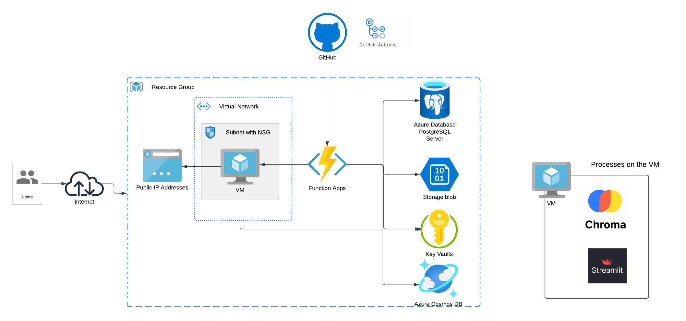

# Azure-terraform-iaac-practice1
# Terraform Azure Cloud Infrastructure

## Overview

This project demonstrates the use of **Terraform** to automate the deployment of various Azure resources and infrastructure. By defining infrastructure as code (IaC), we can easily replicate and manage our Azure environment. This includes creating virtual machines, databases, networking, storage, function apps, and more.

The resources are provisioned based on a detailed configuration that ensures a reliable and scalable infrastructure in Microsoft Azure. All components are described and controlled through **Terraform**, which simplifies managing infrastructure and reduces the possibility of human error.



In addition to the infrastructure, this guide helps you visualize your cloud architecture and understand the relationships between different resources.

## Resources Deployed

The following Azure resources are deployed through this Terraform configuration:

### 1. **Resource Group**
   - A resource group is created to group all the resources together in a single logical container for management.

### 2. **Networking**
   - A **Virtual Network** (`azurerm_virtual_network`) is created to provide isolated networking for resources.
   - A **Subnet** (`azurerm_subnet`) is configured within the VNet for resource placement.
   - **Network Interface** (`azurerm_network_interface`) and **Network Security Group** (`azurerm_network_security_group`) are created for network connectivity and security.

### 3. **Compute**
   - An **Azure Virtual Machine** (`azurerm_linux_virtual_machine`) is provisioned with SSH key authentication.
   - An **App Service Plan** (`azurerm_app_service_plan`) and a **Function App** (`azurerm_function_app`) are created for running serverless functions with Python as the runtime.

### 4. **Storage**
   - A **Storage Account** (`azurerm_storage_account`) is created to store data and configuration for the function apps.
   - A **Storage Container** (`azurerm_storage_container`) is set up within the storage account for secure blob storage access.

### 5. **Database**
   - A **PostgreSQL Flexible Server** (`azurerm_postgresql_flexible_server`) is deployed along with a **database** (`azurerm_postgresql_flexible_server_database`) for application data storage.

### 6. **Key Vault**
   - An **Azure Key Vault** (`azurerm_key_vault`) is set up for storing secrets, certificates, and sensitive information.

## Prerequisites

Before applying the Terraform configuration, ensure that you have the following:

- **Terraform** installed on your machine.
- **Azure CLI** installed and logged in to your Azure account.
- An active **Azure Subscription** with sufficient permissions.

## How to Apply the Terraform Code

1. Clone the repository or download the code to your local machine.
2. Navigate to the project directory and run the following commands:

```bash
terraform init
terraform plan
terraform apply
